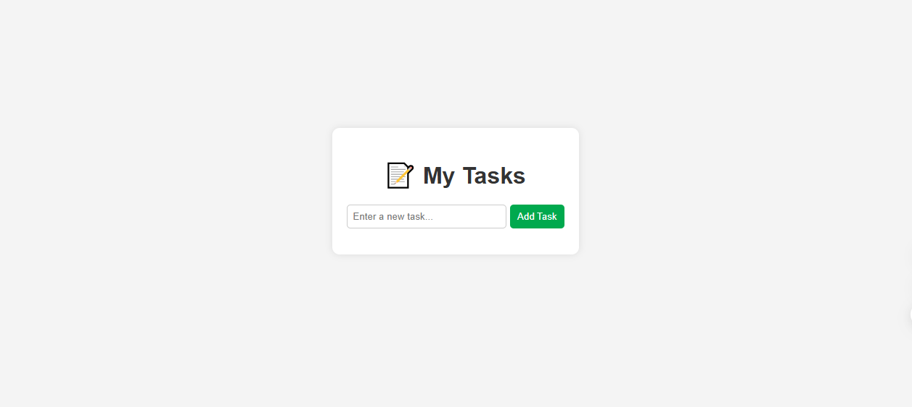

# ✅ Personal Task Manager

A simple web application to manage daily tasks, built using **HTML, CSS, and JavaScript** only.

---

## 🚀 Features
- ➕ Add new tasks.
- ✅ Mark tasks as completed or not completed.
- ❌ Delete tasks.
- 💾 Save tasks in **Local Storage** so they remain after refreshing the page.

---

## 🛠️ Technologies Used
- **HTML5** – Structure of the web page.
- **CSS3** – Styling and layout.
- **Vanilla JavaScript** – Task management and Local Storage handling.

---

## 🌐 Live Demo
🔗 [Click here to try it](https://lmaakoul.github.io/task-manager/)  

---

## 📸 Screenshot
  
*(You can add a screenshot of your app here by uploading an image named `screenshot.png` to your repository)*

---

## 📩 Contact
If you have any questions or feedback, feel free to reach out to me on [LinkedIn](https://www.linkedin.com/in/mustapha-el-maakoul-14293116a/)).

